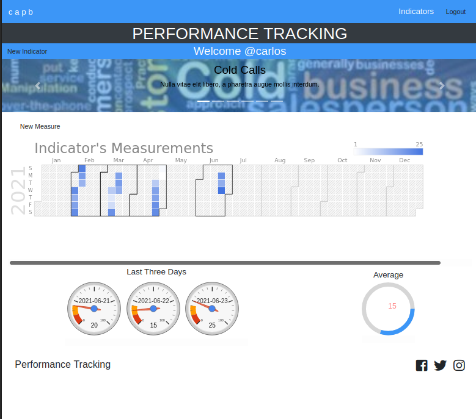

# PERFORMANCE TRACKING APP
> This is the Front-End application for the PERFORMANCE TRACKING system.
## Built With

- React
- Redux
- Javascript
- CSS

## Live Demo

[RecipeCook ON HEROKU](https://tranquil-mesa-95078.herokuapp.com/)

## Screen shot


## Installation


* Install Node in your system. To install Node, you can read the Documentation

* Clone or download the zip file into your machine. CD into the folder and run

```npm install```

## Available Scripts

In the project directory, you can run:

### ```npm start```

Runs the app in the development mode.<br>

The page will reload if you make edits.<br>
You will also see any lint errors in the console.

### `npm test`

Launches the test runner in the interactive watch mode.<br>
See the section about [running tests](#running-tests) for more information.

### `npm run build`

Builds the app for production to the `build` folder.<br>
It correctly bundles React in production mode and optimizes the build for the best performance.

## Author

👤 Carlos Prieto Barron

- Github: [@carlosprietobarron](https://github.com/carlosprietobarron)
Linkedin: [Carlos Prieto Barrón](https://www.linkedin.com/in/carlosprietobarron/)
## 🤝 Contributing


Contributions, issues and feature requests are welcome!

Feel free to check the [issues page](issues/).

## Show your support
